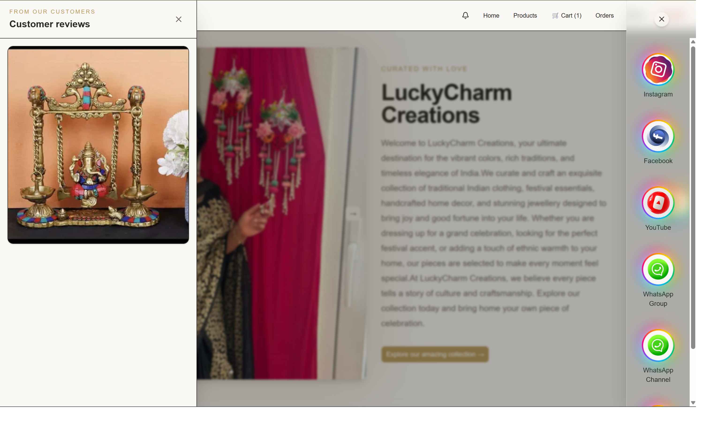
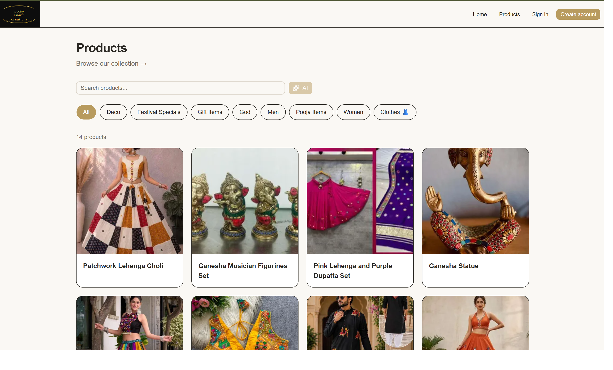
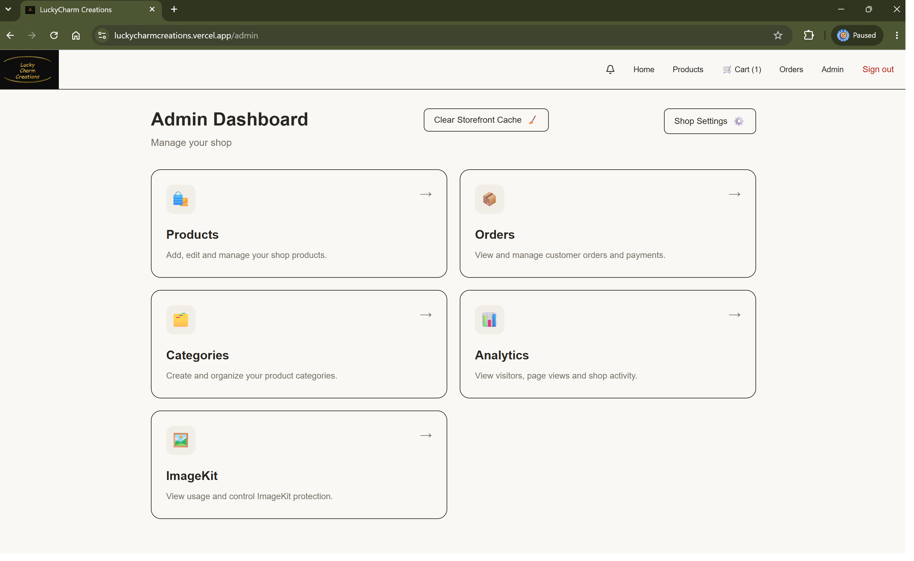
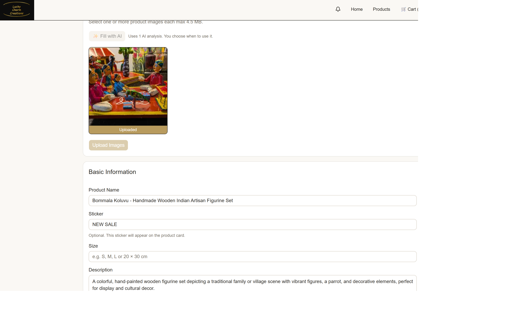
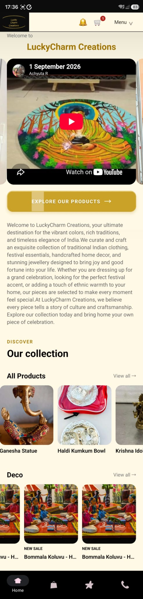

# Lucky's Collection — Commerce Platform

A complete web and Android commerce platform built for a real client selling Indian products.

This project was **independently designed and developed end-to-end by Anupama Rajendra**, covering storefront design, database architecture, authentication, admin workflows, ordering, mobile integration, deployment, performance optimisation, analytics, notifications, and media handling.

🌐 **Live Store:**  
https://luckycharmcreations.vercel.app/

📱 **Mobile Repository:**  
https://github.com/luckyscollectionshop-afk/mobileshop

---

## Screenshots

### Storefront



The customer-facing storefront with product browsing, categories, product cards, and commerce navigation.

---

### Commerce Flow



Customer commerce experience including product browsing and shopping workflows.

---

### Admin Dashboard



Administrative tools for managing the store, products, categories, settings, and business workflows.

---

### AI-Assisted Product Workflow



AI-assisted product analysis helps the administrator prepare product information and reduce repetitive data entry.

---

### Android Application



The companion Android application built with React Native and Expo, providing mobile access to the commerce platform.

---

## Project Overview

Lucky's Collection is more than a storefront.

The platform includes:

- customer-facing ecommerce experience
- admin product and category management
- configurable homepage content
- authentication
- cart and checkout
- order management
- notifications
- analytics
- AI-assisted product workflows
- mobile application
- configurable catalogue behaviour
- media optimisation
- cost-conscious infrastructure

The project was designed around a strong client requirement:

> Keep infrastructure costs at **0 CHF wherever feasible**, while still supporting a practical production-ready commerce workflow.

---

## Main Features

### Storefront

Customers can:

- browse products
- search products
- filter by category
- view product details
- view product images and media
- add products to cart
- complete checkout
- select payment method
- review previous orders
- follow order status

---

## Product Management

Administrators can:

- create products
- edit products
- manage stock
- manage pricing
- configure sale prices
- assign categories
- upload product images
- manage display settings
- add stickers / promotional labels
- control product availability
- manage YouTube post links

---

## AI-Assisted Product Workflows

The admin experience includes AI-assisted product analysis.

AI can help generate or suggest:

- product name
- product description
- product information
- useful searchable product attributes

The storefront also supports natural-language product discovery so customers can search using more conversational queries.

---

## Catalogue Mode

The platform includes a configurable **Catalogue Mode**.

When enabled:

- customers can browse products
- public prices can be hidden
- ordering workflows remain available
- detailed pricing can be discussed privately with the seller

This is useful for businesses that want to display their collection without exposing all pricing publicly.

---

## Cart & Checkout

The customer checkout flow includes:

- shipping information
- order summary
- product quantities
- payment selection
- order creation
- confirmation flow

Supported payment configuration includes:

- TWINT
- Bank Transfer

---

## Orders

Customers can:

- view their orders
- open order details
- follow the order timeline
- see payment and fulfilment information

Administrators can:

- view all orders
- mark orders paid / unpaid
- update order status
- track progress from order creation to delivery

Order statuses include flows such as:

```text
Pending Payment
      ↓
Processing
      ↓
Shipped
      ↓
Delivered
```

---

## Notifications

The system supports application notifications including:

- new order notifications
- stock warnings
- low-stock notifications
- out-of-stock notifications
- customer order updates

---

## Analytics

The storefront tracks useful usage information such as:

- visitor sessions
- page views
- monthly statistics
- storefront activity

This gives the business basic operational insight without requiring an expensive analytics platform.

---

## Media Architecture

Product media is handled using **ImageKit**.

The project uses image optimisation to reduce unnecessary bandwidth and keep the site lightweight.

Typical image sizes are optimised for different contexts:

- larger images for product details and hero sections
- smaller images for product lists and compact UI

Fallback images are used when product media is unavailable.

---

## YouTube Integration

External YouTube links can be associated with products.

Rather than automatically loading heavy video previews everywhere, links are used selectively to reduce unnecessary traffic and bandwidth usage.

---

## Authentication

The platform supports:

- email authentication
- Google OAuth
- user profiles
- customer / admin roles
- password recovery

Access to administrative functionality is role protected.

---

## Security

Supabase Row Level Security is used to protect application data.

Examples include:

- customers only accessing their own cart
- customers only accessing their own orders
- public access to active products
- admin-only management operations
- user-specific notifications

---

## Performance & Caching

Caching is used to improve storefront performance and reduce unnecessary backend traffic.

Frequently accessed storefront and product data is cached with controlled revalidation.

The admin interface also includes a manual cache-clear action for situations where immediate refresh is required.

---

## Mobile Application

Lucky's Collection also includes an Android application built with:

- React Native
- Expo
- Expo Router

The mobile experience includes customer-facing product browsing and commerce workflows.

Mobile repository:

https://github.com/luckyscollectionshop-afk/mobileshop

---

## Technology Stack

### Web

- Next.js
- React
- TypeScript
- Tailwind CSS

### Backend & Data

- Supabase
- PostgreSQL
- Row Level Security
- REST-style application APIs

### Mobile

- React Native
- Expo
- Expo Router

### Authentication

- Supabase Auth
- Email Authentication
- Google OAuth

### Media

- ImageKit
- YouTube links

### Notifications

- Application notifications
- Mobile notification architecture

### AI

- AI-assisted product analysis
- Natural-language product discovery

### Deployment

- Vercel

---

## Architecture

```text
Customer / Admin
      ↓
Next.js Web App
      ↓
Application APIs
      ↓
Supabase Auth + PostgreSQL
      ↓
Orders / Products / Categories / Analytics
```

External services are used selectively:

```text
ImageKit → Optimised product media
YouTube  → External video content
AI       → Product assistance / discovery
```

The Android application works with the same backend ecosystem.

---

## Cost-Conscious Engineering

One of the most important engineering constraints for this project was infrastructure cost.

The platform was designed around a **0 CHF infrastructure target wherever feasible**.

Strategies included:

- free-tier infrastructure
- aggressive image optimisation
- caching frequently accessed data
- avoiding unnecessary video hosting
- using external media links
- monitoring media usage
- keeping backend traffic controlled

This constraint influenced architecture decisions throughout the project.

---

## Running Locally

### 1. Clone the repository

```bash
git clone https://github.com/luckyscollectionshop-afk/shop.git
```

### 2. Enter the project

```bash
cd shop
```

### 3. Install dependencies

```bash
npm install
```

### 4. Configure environment variables

Create the required `.env.local` file with the project's Supabase and service configuration.

Do not commit private credentials to GitHub.

### 5. Start development

```bash
npm run dev
```

### 6. Production build

```bash
npm run build
```

---

## Deployment

The web application is deployed on **Vercel**.

Live application:

https://luckycharmcreations.vercel.app/

---

## Development

**Independent end-to-end development by Anupama Rajendra**

Work included:

- architecture
- database design
- authentication
- frontend development
- backend APIs
- admin tooling
- mobile integration
- AI features
- performance optimisation
- caching
- deployment
- infrastructure cost control

---

## Developer

**Anupama Rajendra**

Software Engineer  
**Java · SQL · Unix / Shell Scripting · Enterprise Integration · Full-Stack · Mobile**

Portfolio:  
https://A-nu-1.github.io/anupamaportfolio/

GitHub:  
https://github.com/A-nu-1

---

## Related Repository

### Android App

https://github.com/luckyscollectionshop-afk/mobileshop

---

## Project Status

This is a real client commerce application developed for Lucky's Collection.

The repository documents the engineering work behind the deployed platform.